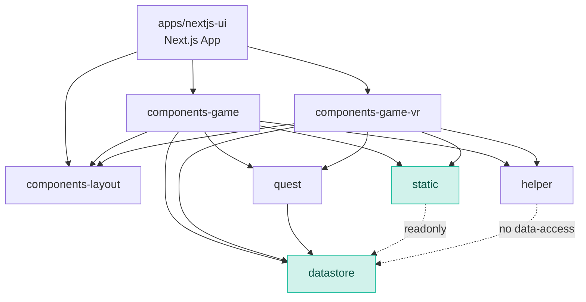

# Architecture

This repo is an Nx monorepo with a Next.js UI app and several libraries grouped by responsibility. The app composes features from libraries; libraries are the primary units of reuse and ownership.

## Top-level layout

- apps/nextjs-ui: Next.js app. Routes, page-level data fetching, and top-level providers.
- libs/components-game: React feature components (Templates, Organisms, Molecules, Atoms).
- libs/components-game-vr: React feature components for WebXR/Three.js.
- libs/components-layout: Shared UI components (layout primitives, icons).
- libs/datastore: Data-access layer for runtime state and persistence via Dexie/IndexedDB.
- libs/static: Static datasets and readonly exports (e.g., scenes).
- libs/helper: General-purpose pure utilities. No data-access calls.
- libs/quest: Quest-specific helpers. May call data-access.
- types/: Global .d.ts files for shared types across packages.

See workspace.json and tsconfig.base.json for the official project map and path aliases.

## Layering rules

- Feature/UI components (components-*) may depend on layout, helper, static, quest, and datastore.
- helper must not import from datastore. quest helpers are allowed to call datastore.
- static exports must be readonly and must not import from datastore.
- datastore must not import React, Next.js, or UI packages.
- Pages in apps/nextjs-ui orchestrate features and perform app-level wiring only.

## Component data flow

- Prefer lifting data-fetching to pages/containers; pass data via props to feature components.
- Keep local component state minimal; persist durable state via datastore.
- Expose narrow public APIs from each library via src/index.ts re-exports.

## Module boundaries and path aliases

Use path aliases defined in tsconfig.base.json instead of deep relative imports:

- @components-game, @components-game-vr, @components-layout
- @datastore, @static, @helper, @quest

## Three.js / XR

- three and @react-three/* usage stays inside UI/feature libraries and the Next.js app.
- Don’t leak Three types into datastore or helper.

## Why Nx

- Consistent build/test targets per project
- Affected commands optimize CI and local dev
- Enforces isolation of libraries and encourages incremental design

## Dependency graph hygiene

- Create a new library when a module is reused by multiple features with a stable API.
- Keep libraries small with clear ownership. Avoid cross-library circular dependencies.
- Breaking changes must be documented in PRs and reflected in these docs if policy changes.
