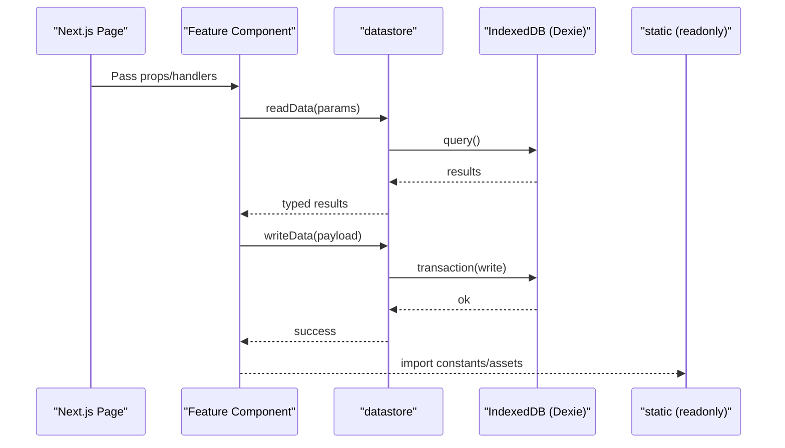

# Data Access

The datastore library provides query and mutation functions backed by Dexie/IndexedDB. Static datasets live in the static library.

## Libraries and responsibilities

- datastore: runtime persistence and queries. Owns Dexie schemas and transactions.
- static: readonly data (e.g., GLTF scenes, constants). No runtime mutations.
- helper: pure helpers; must not depend on datastore.
- quest: quest-specific helpers; may call datastore.

## Patterns

- All persistence goes through datastore. Do not access IndexedDB directly from components.
- Expose narrow async functions for reads/writes. Keep Dexie tables internal to datastore.
- Use dexie-react-hooks only within UI layers consuming datastore APIs.
- Validate inputs at the datastore boundary and return typed results.

## Error handling and transactions

- Wrap multi-step writes in Dexie transactions to keep state consistent.
- On errors, throw domain-specific errors with actionable messages.

## Versioning and migrations

- If Dexie schema changes, increment the version and provide an upgrade path.
- Keep a migrations note in PR description when datastore schemas evolve.

## Static data

- Export TS constants and assets from static. Avoid dynamic imports from runtime-only libraries.
- Do not import datastore from static.
