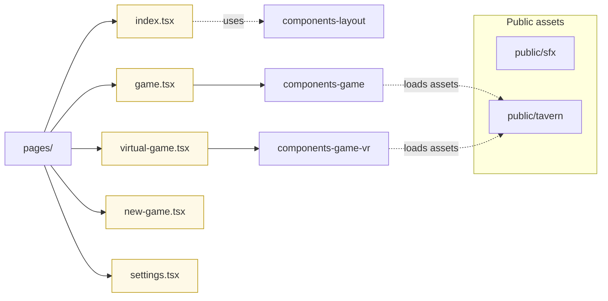

# Next.js App

The Next.js app lives in apps/nextjs-ui.

## Routes and pages

- Pages under apps/nextjs-ui/pages define routes (index, game, virtual-game, new-game, settings).
- _app.tsx sets up global providers; _document.tsx customizes HTML document.

## Assets

- Public assets are under apps/nextjs-ui/public. Three/XR scenes live under public/tavern/.
- Use Next static file serving and import types when possible.

## WebXR and SSL

- WebXR features require a secure origin. Use pnpm run startSSL to proxy 4200 -> 3000 with SSL.

## Build and analyze

- Build: pnpm run build
- Bundle analysis: pnpm run build-analyze (sets ANALYZE=true and builds)
