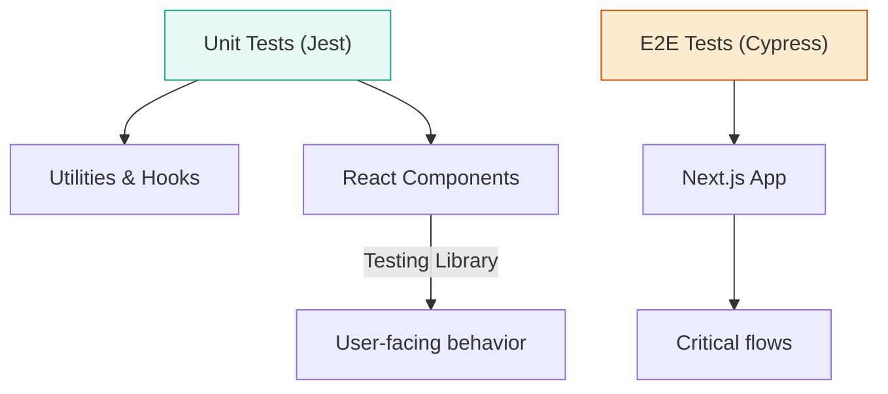

# Testing

We use Jest for unit tests and Cypress for end-to-end tests.

## Commands

- Unit tests (affected): pnpm test
- Run lint fixes: pnpm run fix-lint
- Run style fixes: pnpm run fix-stylelint

Refer to apps/nextjs-ui-e2e for Cypress setup.

## Unit testing

- Place .spec.ts or .spec.tsx next to the implementation or in __tests__ folders.
- Test public behavior, not internal implementation details.
- For React components, favor Testing Library queries over container.children.

## E2E testing

- Use Cypress specs under apps/nextjs-ui-e2e/src/integration.
- Keep tests independent; reset state between tests.

## Snapshots

- Use sparingly for stable visual components or generated structures.

## Performance and VR

- For three/XR components, unit test logic in hooks; prefer smoke tests in E2E for the scene mount.
