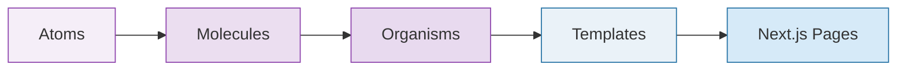

# UI Components

We follow Atomic Design in feature/UI libraries:

- Atoms: Smallest reusable building blocks (buttons, inputs, icons wrapper).
- Molecules: Composition of atoms with minimal logic.
- Organisms: Feature-level compositions with clear responsibilities.
- Templates: Page-level layouts that arrange organisms.

## Structure

- libs/components-game/src/lib/{atoms|molecules|organisms|templates}
- libs/components-game-vr/src/lib/{atoms|molecules|organisms}
- libs/components-layout/src/lib

## Guidelines

- Data via props. Do not fetch inside components unless it’s an isolated VR/Three interaction where lift-up is impractical.
- Keep visual components presentational; separate interaction logic into hooks.
- Export only public components from src/index.ts.
- Co-locate tests as ComponentName.spec.tsx beside components (or in __tests__).
- Prefer accessibility by default: use semantic elements and aria- attributes as flagged by eslint-plugin-jsx-a11y.

## Styling

- Prefer CSS Modules or styled components pattern supported in this repo. Keep styles local to the library.
- Shared spacing/typography primitives live in components-layout.

## Three.js / XR components

- Contain Three objects and XR logic within components-game-vr. Avoid leaking three imports to other libraries.
- Keep scene graph construction declarative using @react-three/fiber and @react-three/drei.
