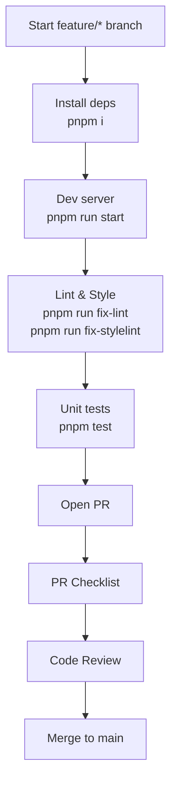

# Workflows

Standardize how we develop, test, and ship changes.

## Local development

1. Install Nx CLI globally (once): pnpm install -g nx
2. Install deps: pnpm i
3. Start dev server: pnpm run start (http://localhost:4200)
4. Optional WebXR via SSL proxy: pnpm run startSSL (https://localhost:3000)

## Branching

- main is protected. Use feature/* or fix/* branches.
- Keep PRs small and focused.

## Pull Requests

- Include a concise summary, screenshots for UI, and note any schema changes.
- Check the PR checklist (see pr-checklist.md) before requesting review.

## Linting and tests

- Run pnpm run fix-lint and pnpm run fix-stylelint locally.
- Run pnpm test to ensure affected unit tests pass.

## Releases

- Tag releases from main after PRs merge. Document notable changes in the PR body.
